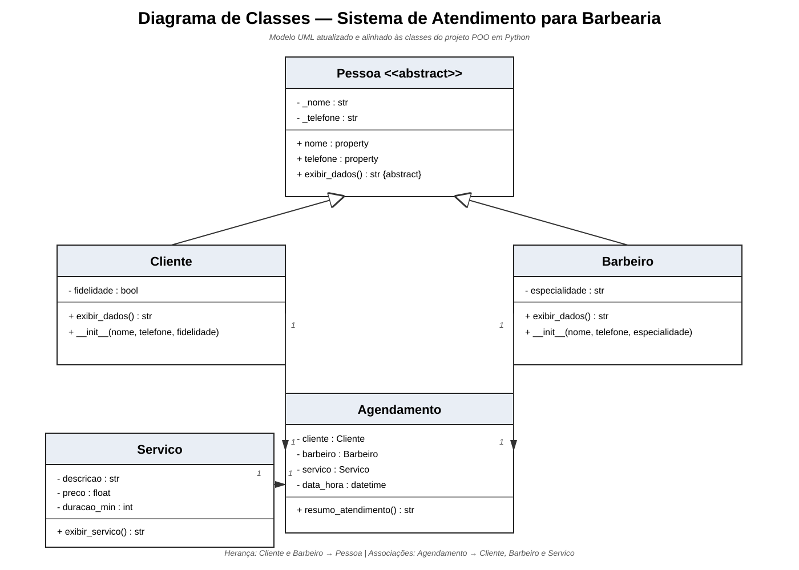

# Sistema-de-genrenciamento-de-atendimento-para-barbearia

Projeto desenvolvido como trabalho acadêmico da disciplina de **Programação Orientada a Objetos (POO)**, utilizando a linguagem **Python**.

## 📌 Sobre o Projeto
O sistema automatiza o fluxo de atendimento de uma barbearia, permitindo o gerenciamento de clientes, profissionais (barbeiros), catálogo de serviços e o registro de agendamentos com data e horário marcados.

## 🛠️ Conceitos de POO Aplicados
* **Abstração:** Uso de classes abstratas (`ABC`) para padronizar estruturas.
* **Herança:** Reaproveitamento da classe base `Pessoa` nas subclasses `Cliente` e `Barbeiro`.
* **Encapsulamento:** Proteção de atributos internos com propriedades (`@property`).
* **Polimorfismo:** Sobrescrita do método `exibir_dados()` nas classes filhas.
* **Associação:** Integração entre `Cliente`, `Barbeiro` e `Servico` dentro da classe `Agendamento`.

## 📐 Diagrama de Classes

O diagrama representa as classes `Pessoa`, `Cliente`, `Barbeiro`, `Servico` e `Agendamento`, incluindo herança, atributos, métodos e as associações utilizadas pelo sistema.



### Principais relacionamentos

- `Cliente` herda de `Pessoa`.
- `Barbeiro` herda de `Pessoa`.
- `Agendamento` possui uma referência para um `Cliente`.
- `Agendamento` possui uma referência para um `Barbeiro`.
- `Agendamento` possui uma referência para um `Servico`.

## 🚀 Como Executar o Projeto

1. Certifique-se de ter o **Python** instalado em sua máquina.
2. Clone este repositório ou baixe os arquivos.
3. Abra o terminal na pasta raiz do projeto e execute o seguinte comando:

```bash
python src/main.py
```
